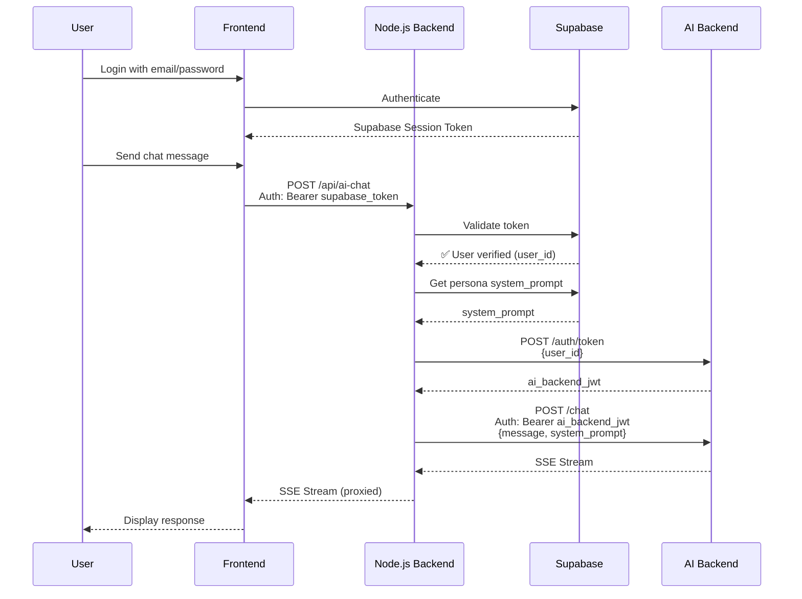

# 🔐 Authentication Fix - Persona Integration

## Problem

The frontend was getting a **401 Unauthorized** error when calling `/api/ai-chat` because:

1. **Frontend** was sending JWT token from AI backend (port 8000)
2. **Node.js backend** was expecting Supabase token for authentication

This created an authentication mismatch!

---

## Solution

Implemented a **two-token system**:

### Token Flow

```
Frontend (User logs in with Supabase)
    ↓
Gets Supabase access token
    ↓
Sends to Node.js Backend: POST /api/ai-chat
    Header: Authorization: Bearer <supabase_token>
    ↓
Node.js Backend:
    1. Validates Supabase token ✅
    2. Extracts user_id
    3. Gets persona system_prompt from Supabase
    4. Creates AI backend JWT token for that user_id
    ↓
Forwards to AI Backend: POST /chat
    Header: Authorization: Bearer <ai_backend_token>
    Body: {message, system_prompt}
    ↓
AI Backend responds with persona personality ✅
```

---

## Changes Made

### 1. Frontend: Use Supabase Token
**File**: `src/services/ai-chat.service.ts`

**Changed from** (sending AI backend JWT):
```typescript
const response = await fetch(`${apiUrl}/ai-chat`, {
  headers: {
    'Authorization': `Bearer ${token}`, // ❌ AI backend JWT
  }
});
```

**To** (sending Supabase token):
```typescript
// Get Supabase token for Node.js backend authentication
const supabaseToken = await this.authService.getSession();
const supabaseAccessToken = supabaseToken?.session?.access_token;

const response = await fetch(`${apiUrl}/ai-chat`, {
  headers: {
    'Authorization': `Bearer ${supabaseAccessToken}`, // ✅ Supabase token
  }
});
```

### 2. Backend: Create AI Backend Token
**File**: `backend/routes/ai-chat.js`

**Added token creation step**:
```javascript
// After authenticating user with Supabase token
// Create JWT token for AI backend
const tokenResponse = await fetch(`${aiBackendUrl}/auth/token`, {
  method: 'POST',
  body: JSON.stringify({
    user_id: req.user.id, // Authenticated user's ID
    expires_in_hours: 24
  }),
});

const tokenData = await tokenResponse.json();
const aiBackendToken = tokenData.access_token;

// Forward to AI backend with this token
const response = await fetch(`${aiBackendUrl}/chat`, {
  headers: {
    'Authorization': `Bearer ${aiBackendToken}`, // ✅ AI backend JWT
  }
});
```

---

## Authentication Flow Diagram



---

## Why Two Tokens?

### Supabase Token (Frontend → Node.js)
- **Purpose**: Authenticate user with your main application
- **Contains**: User identity, permissions
- **Validated by**: Node.js backend using Supabase SDK
- **Used for**: User profile access, database operations

### AI Backend JWT (Node.js → AI Backend)
- **Purpose**: Authenticate with AI service
- **Contains**: User ID for conversation isolation
- **Validated by**: AI backend using its own JWT secret
- **Used for**: Chat requests, memory storage

---

## Security Benefits

1. **Separation of Concerns**: 
   - Main auth (Supabase) separate from AI auth
   - Each service validates only what it needs

2. **No Credential Sharing**:
   - AI backend doesn't need Supabase credentials
   - Tokens are created on-demand per request

3. **User Isolation**:
   - Each user gets their own AI backend token
   - Conversations and memories are isolated

4. **Token Scope**:
   - Supabase token: Full app access
   - AI token: Only chat access

---

## Testing

### Test 1: Verify Supabase Authentication

```bash
# This should work now that frontend sends Supabase token
# 1. Login to your app
# 2. Select a persona (Elara)
# 3. Send a message
# Expected: Chat works! ✅
```

### Test 2: Check Backend Logs

You should see:
```
📝 Fetching persona 1 from Supabase...
✅ Found persona: Elara
🔑 Getting JWT token for AI backend...
✅ AI backend token ready
🚀 Forwarding to AI backend: http://localhost:8000/chat
📡 Streaming response back to frontend...
✅ Stream complete
```

### Test 3: Check Token in DevTools

**Network Tab** → `/api/ai-chat` request:
```
Request Headers:
  Authorization: Bearer eyJhbGc... (Supabase token)
```

---

## Troubleshooting

### Still Getting 401 Error?

**Check 1**: User is logged in
```typescript
// In browser console
console.log(authService.currentUser());
// Should show user object
```

**Check 2**: Supabase session exists
```typescript
// In browser console
authService.getSession().then(s => console.log(s));
// Should show session with access_token
```

**Check 3**: Backend has correct .env
```bash
# Check .env has SUPABASE_SERVICE_ROLE_KEY
cat .env | grep SUPABASE_SERVICE_ROLE_KEY
```

### Backend Token Creation Fails?

**Check**: AI backend is running
```bash
lsof -i :8000 | grep LISTEN
```

**Check**: Can create token manually
```bash
curl -X POST http://localhost:8000/auth/token \
  -H "Content-Type: application/json" \
  -d '{"user_id": "test"}'
```

---

## Summary

✅ **Frontend**: Sends Supabase token (user is already logged in)  
✅ **Node.js Backend**: Validates Supabase token, creates AI backend token  
✅ **AI Backend**: Receives AI backend JWT token  
✅ **Personas**: System prompts fetched and applied  

The authentication flow is now complete and secure! 🎉

---

## Files Modified

1. `src/services/ai-chat.service.ts` - Use Supabase token
2. `backend/routes/ai-chat.js` - Create AI backend token

---

**Status**: ✅ FIXED - Try chatting now!

